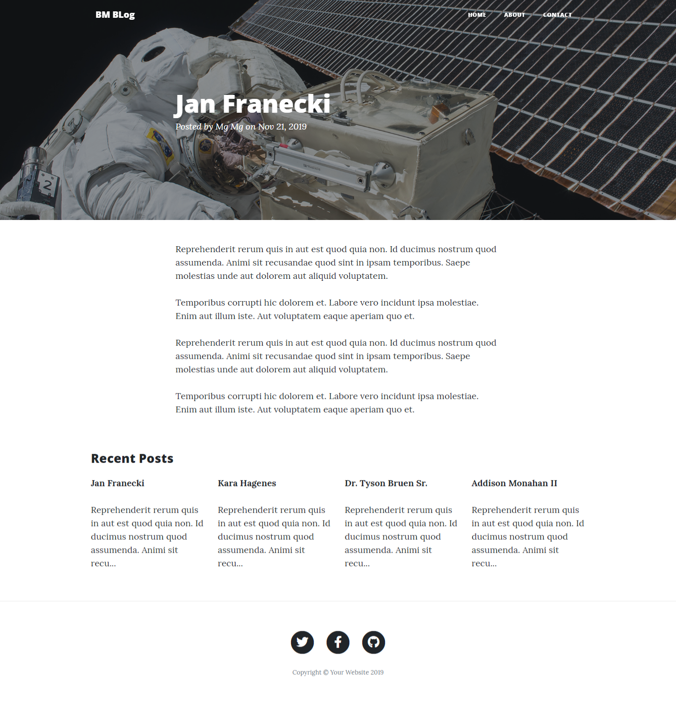
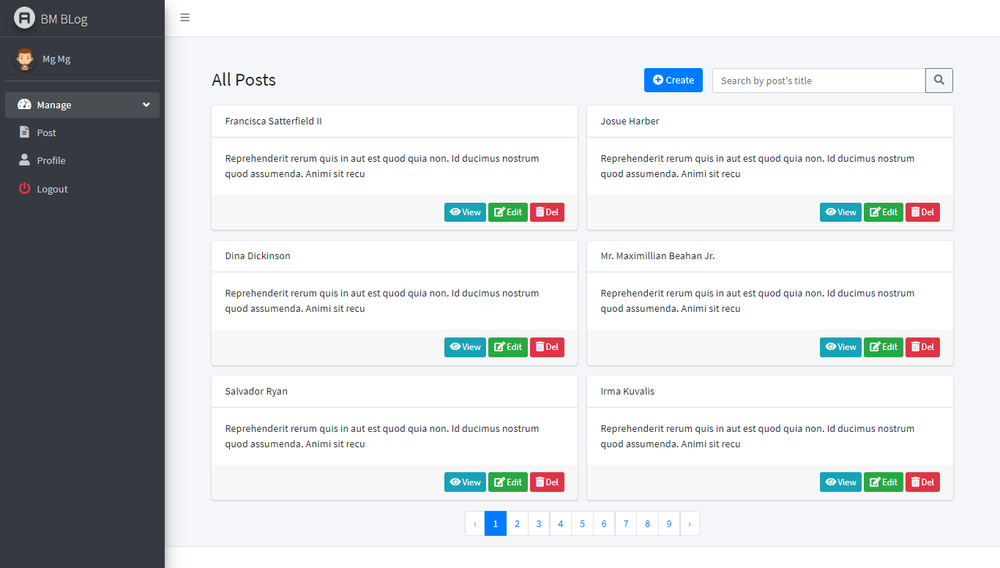
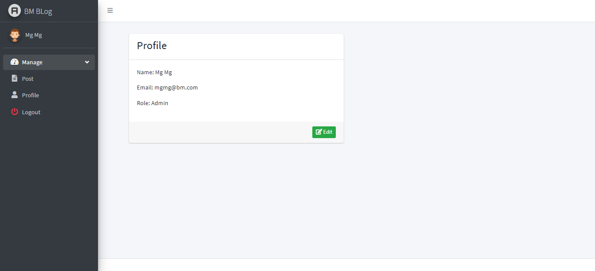

# Blog Project Sample

### Demo

__Home Page__
<br><br>

<br><br> 
__Post Detail__
<br><br>

<br><br> 
__About Page__
<br><br>

<br><br> 
__Contact Page__
<br><br>

<br><br> 
__Admin All Posts Page__
<br><br>

<br><br> 
__Admin User Profile Page__
<br><br>


### Themes

- [Adminlte3](https://adminlte.io/themes/dev/AdminLTE/index.html)
- [startbootstrap](https://startbootstrap.com/themes/clean-blog/)

### Tools/Plugins

- Bootstrap
- Fontawesome
- Summernote

### Packages

- composer require tymon/jwt-auth "1.*"

### Artisan Command

- php artisan make:controller PageController
- php artisan make:controller PageController -r
- php artisan make:model Post -m
- php artisan make:model Post --migration
- php artisan make:model Post -mcrf (migration, controller with resouce, factory)
- php artisan make:model Post --all (migration, controller with resouce, factory)
- php artisan migrate
- php artisan make:auth
- php artisan serve
- php artisan serve --port=3000
- php artisan make:middleware AuthWare
- php artisan make:seeder PostSeeder
- php artisan db:seed --class=PostSeeder
- php artisan db:seed
- php artisan migrate:reset 
- php artisan migrate
- php artisan migrate:fresh
- php artisan migrate:fresh --seed
- php artisan make:request PostRequest
- php artisan route:list
- php artisan make:resource PostResource
- php artisan make:factory RostFactory
- php artisan tinker (laravel command line tool)

### Git 

```
$ git init
$ git add .
$ git commit -m "sample crud"
$ git remote add origin https://github.com/bm-member/bm-blog-2.git
$ git push -u origin master
```

### Installation 

```
$ git clone https://github.com/bm-member/bm-blog-2.git
$ copy .env.example .env
$ config db setting 
$ composer install
$ php artisan key:generate
$ php artisan migrate --seed
$ php artisan serve
$ done.
```